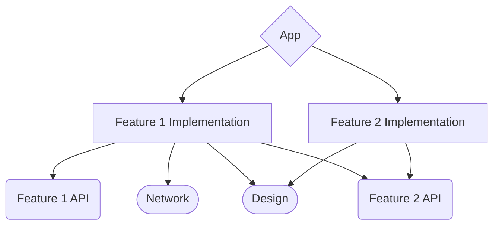

# This is an AVIV test project
It parses JSON from test API, and then shows it in simple interface.

## Libraries Used:
* **Ktor client**
* **Coroutines**
* **Kotlin Serialization**
* **Koin**
### For UI:
* **Jetpack Compose**
* **Glide**
### For Tests:
* **JUnit 4**
* **Espresso**
***
# What could've been done better
There are few things that are not ***perfect*** in this project, but were good enough for such small app.
But still I feel it's important to mention them.
##### Modularisation
There is generally no need to divide app with less then ~10 screen into modules, since it would only increase complexity without any significant benefits for build time and preventing merge conflicts in small team.
But if there will be further development, one way of modularisation would be:
* **App module** - containing Main Activity, Application class, DI and navigation (navigation and DI also could be extracted into separate modules, but there tend to be need for this only in teams with 50 or more developers).
* **Design Module** - **Core** module, containing styles, fonts, Views/Composables. Preferably dependent only to core libraries, and used in feature modules.
* **Network Module** - **Core** module, containing all networking logic and providing simple interfaces to make safe network requests, with all needed credentials, cookies, headers, etc.
* **Feature API Module** - containing Interfaces for feature and entry data to call it from other modules. API module can be used in any other feature module.
* **Feature Implementation Module** - containing all logic and UI for feature. Can implement any **API** modules, or **Core** modules. Can be implemented only in **App** module
  For only one feature structure could look like this:

##### Navigation
For two screens any navigation works pretty well! Yet it's important to either use a well-tested and thought-through library, or make our own. Personally, I prefer navigation paradigm like one used in [Voyager](https://github.com/adrielcafe/voyager).
##### More tests
There is just not enough data to thoroughly test all possible combinations, both for data layer Unit tests and for UI tests. But I would definitely make more test JSONs for local tests, checking every possible combination
